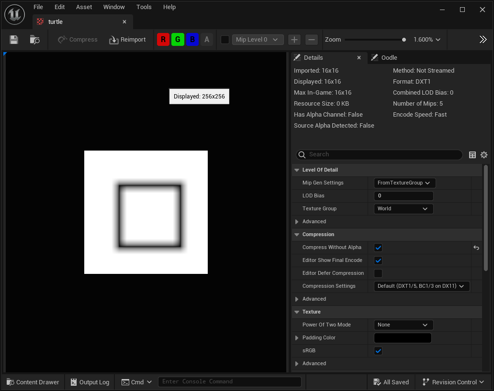

# LOGO Virtual Machine for UE
A LOGO Virtual Machine Plugin for Unreal Engine 

This plugin adds the "logo path/to/file.logo" console command to execute LOGO programs, drag-n-drop of .logo files to generate a texture from them and a blueprint function library that adds functions to execute Logo Programs.

It can execute the following commands: fd, bk, rt, lt, ct, cs, pu, pd, pc.

Available pen colors: 0 = Black, 1 = White, 2 = Red, 3 = Blue, 4 = Green, 5 = Yellow, 6 = Cyan, 7 = Magenta, 8 = Orange.

I used [this website](https://www.transum.org/software/Logo/) to write .logo files and test them

